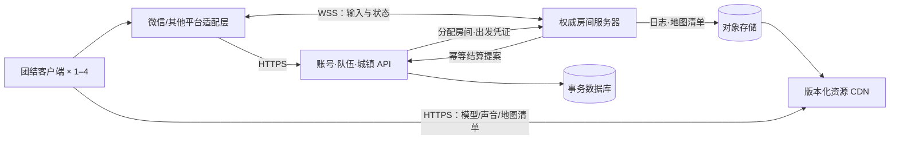
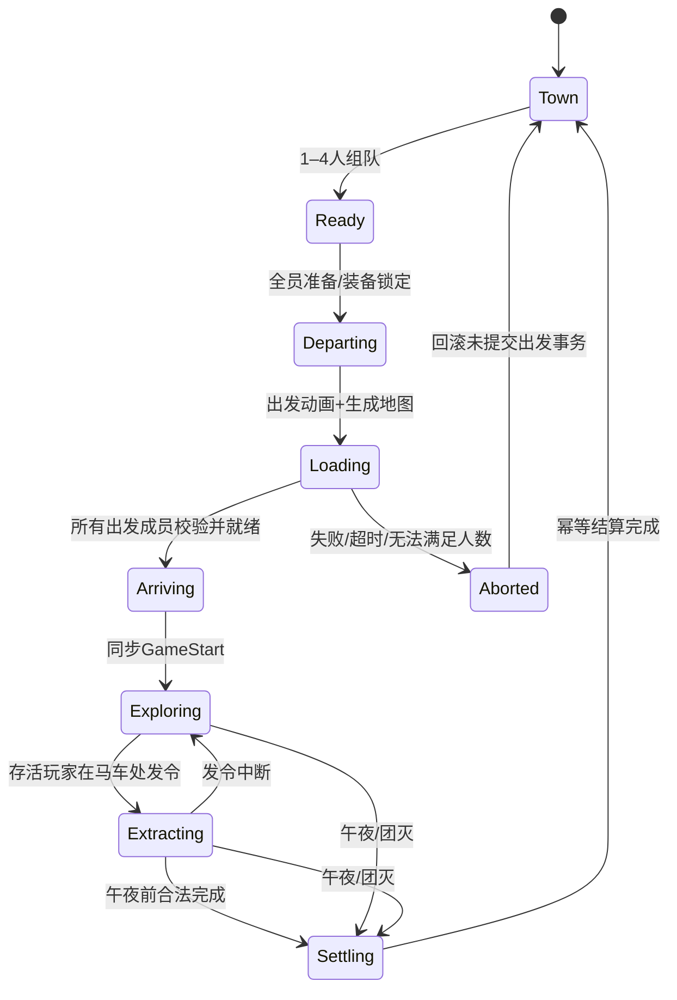

# 《致命地下城》技术架构草案

版本：v0.2.2 · 2026-09-07 · 设计评审稿，尚未实现或实测

需求来源：[01-需求规格.md](./01-需求规格.md)。本文中技术选型与实现方案仍为建议；第3.1–3.5节和第12.0节的研发规范已由用户确认，属于强制要求。玩法以需求文档的“已确认”项为准，各待定项保持显式配置或暂缓实现。目标平台为微信优先、后续国内小游戏；引擎方向为团结引擎＋微信小游戏 SDK。

## 1. 架构结论与边界

建议采用：**团结客户端＋独立权威房间服务器＋城镇/账号后端＋版本化资源 CDN**。

1. 服务器只生成一份地图结构，并校验可玩性；客户端接收结构清单、加载已有 3D 模块。
2. 马车出发动画覆盖地图生成与加载；所有本局成员准备完成后，统一进入到达与危险阶段。
3. 服务器裁定时钟、移动合法性、攻击、怪物感知、物品所有权、撤离与结算。客户端不决定伤害或收益。
4. 非确定性物理不做四端锁步；采用权威状态同步，玩家本地预测与其他实体插值。
5. 精确血攻留在服务端，客户端只收到必要的状态反馈。服务器的“知识”与怪物的“感知”分开，防止盲怪读取玩家真坐标直接追杀。
6. MVP 采用模块化后端，不先拆大量微服务；独立房间进程用于承载实时战斗。
7. **已确认的研发约束：**模块规范先行并写入模块README.md，先编写充足测试用例，再编写实现代码；所有自有模块统一执行测试驱动开发与本项目的AI Harness规则。

不在本轮部署服务、不购买引擎或云资源、不选定未经验证的网络插件。先用兼容性验证锁定版本和库，再开发生产代码。

## 2. 组件与职责



| 模块 | 负责 | 不负责 |
|---|---|---|
| 客户端表现 | 画面、输入、声音、动画、界面、资源加载、预测 | 自行创建战利品、裁定命中和结算 |
| 平台适配层 | 登录、生命周期、网络、存储、音频能力桥接 | 地下城与怪物规则 |
| 城镇后端 | 账号、仓库、金币、商店、队伍、出发事务、结算 | 每帧物理与怪物决策 |
| 房间服务器 | 本局时间、地图、碰撞、AI、交互、死亡与撤离 | 用户支付、客户端渲染 |
| 资源系统 | 固定版本模型、材质、声音、房间目录与下载校验 | 每局生成完整模型文件 |
| 数据库 | 权威资产、出发记录、结算账本 | 高频位置写入 |

### 2.1 技术选择建议

- 客户端：团结稳定版＋匹配的微信 SDK＋C#；简化 URP，固定版本。
- 房间服务：优先同一团结版本的 Linux Dedicated Server，无图形渲染，复用碰撞、导航和规则程序集。若目标版本/许可/运行环境不能满足，才评估 headless 或纯 C# 碰撞服务，不能默默替换导致双端规则分叉。
- 平台通信：HTTPS＋WSS。微信桥接传输必须真机验证；不默认使用桌面端 UDP/KCP/TCP Socket transport。
- 游戏联网框架：本版不锁定 Mirror、NGO 或其他品牌；选择条件是支持所选团结版本、可替换为经过微信真机验证的传输层、服务端权威与状态同步。框架的“支持 WebGL”不等于已支持微信。
- 后端：建议 ASP.NET Core 模块化服务＋关系型数据库（如 PostgreSQL）。初期可单实例运行；业务 ID 和事务边界为后续扩容保留。
- Redis、容器编排、自动扩容按并发和运维需要增加，不作为首个可玩版本的前提。

团结官方列有 Dedicated Server 支持；小游戏官方引擎手册要求按小游戏网络能力适配。这里只据此选择方向，不承诺任意版本和库可直接组合。[S1][S2][S3]

## 3. 代码模块与依赖边界

建议工程程序集划分：

```text
Game.Contracts        协议消息、稳定 ID、枚举；不包含完整怪物数值表
Game.Domain           纯 C# 状态与规则；按发布目标控制引用
Game.Server           房间循环、地图生成、碰撞、AI、战斗与结算提案
Game.Client           输入、预测、渲染、声音、交互 UI
Game.Content          预制模块目录、材质、动画、音效；含客户端必需内容
Game.Platform         IPlatformAuth / IRealtimeTransport / IStorage / IAudio
Game.Editor           模块连接校验、刷点验证、配置检查与开发调试
Backend               城镇、队伍、房间分配、仓库与资产事务
```

原则：业务模块调用接口，不直接散布 `wx.*`；未来适配其他平台优先替换平台层。引擎物理、随机生成与 AI 不需要在客户端重复裁决。服务器数值配置不因“共享程序集”被完整打入客户端。

### 3.1 强制研发方法：规范先行＋测试驱动

**已确认：**整体采用测试驱动开发。用户所称“TTD”在本文按“先测试、后实现”的含义统一记为 **TDD（Test-Driven Development）**；`READNE.md`统一为标准文件名 **`README.md`**，“纰漏”按“披露、明确列出”理解。

本项目的 **AI Harness** 指为人和AI共同提供可读取的模块规范、可执行验证、明确修改边界和可追溯结果的研发约束。此处是本项目对该原则的具体定义，不声称引用某个未指定的外部框架或标准。

适用于客户端、服务端、平台适配、编辑器工具、地图生成、每种怪物、共享协议、后端业务和自有构建脚本。灰盒、原型与修复同样执行，不以“先跑通”为理由先写业务实现再补测试。第三方原版依赖不要求改写其文件，但本项目的封装模块必须有README、规范与适配测试。资源/配置模块也必须说明约束，并先写对应校验用例。

**每个模块按以下顺序开发：**

1. **先定义规范。** 在模块目录创建README.md，写清职责、禁止行为、不变量、输入输出、依赖边界和错误处理；引用已确认需求。尚未确认的玩法显式标注，不能由AI自行补成既定行为。
2. **再设计模块。** 在上述规范约束下确定接口、状态机、目录和依赖，仍在README披露；规范未明确之前不展开内部实现设计。
3. **先写充足测试。** 建立“规范ID→测试用例”矩阵，覆盖正常、边界、异常及适用的状态转换、并发和重试。业务实现前先编写可执行测试；仅有自然语言清单、空测试或TODO不算完成测试先行。
4. **运行并看到合理失败（Red）。** 用未实现接口的最小声明/桩使测试可编译，再验证因缺少目标行为而失败。环境配置损坏、依赖缺失或语法错误不能冒充有效Red证据；桩内不得提前实现业务逻辑。
5. **最小实现（Green）。** 一次实现一个受测试约束的行为，使测试通过；不附带增加未经需求或规范授权的功能。
6. **重构（Refactor）。** 在测试保护下调整结构，不改变规范定义的行为。运行模块测试和受影响依赖的回归，再更新文档、测试映射与验证记录。

“充足”以规则覆盖与有效断言判断，不以用例数量或行覆盖率单独判断。模块当前范围的完整测试矩阵应先建立；编码时仍逐个行为执行Red→Green→Refactor。发现遗漏场景时先补失败测试再修实现，不反向修改期望来迁就错误代码。

### 3.2 每个模块必须自带README.md

第3节列出的程序集是顶层逻辑域，其下独立职责的子模块也必须有自己的README，例如`Inventory/README.md`、`WorldClock/README.md`、`Monsters/Ghost/README.md`。不能用一份根目录README代替全部模块说明；也不要求每个普通类单独建模块。

README应简要且足够执行，至少包含：

| 必填内容 | 必须说明什么 |
|---|---|
| 模块用途与边界 | 解决的问题、明确不负责的事、模块根目录 |
| 需求与状态 | 来源文档/规则ID，哪些已确认、建议、待定 |
| 模块规范 | 唯一规范ID、必须保持的不变量、禁止行为、数据归属与权威边界 |
| 接口契约 | 输入输出、单位、范围、前后条件、错误与幂等语义 |
| 状态与依赖 | 生命周期、状态转换、允许依赖、禁止跨模块访问 |
| 测试说明 | 规范→用例映射、用例位置、准备条件、运行命令、预期成功条件 |
| AI修改边界 | 可修改的范围，扩展范围需更新哪些契约，不能自行做出的玩法决定 |
| 验证与限制 | 最近实际验证结果及证据位置、未运行原因、平台差异和待定项 |

详细材料可链接到模块内其他文档，但README本身必须披露关键规范和禁止事项，不能只写“见架构文档”。禁止填写并不存在的测试命令、测试报告或通过结论；命令尚未建立时标明待建立，并将其视为实现前需要完成的测试基础设施。

**模块README模板：**

```markdown
# <模块名>

## 用途与边界
- 职责：...
- 不负责：...
- 需求来源及状态：...

## 必须遵守的规范
| 规范ID | 规则/禁止事项 | 来源与确认状态 |
|---|---|---|
| <MODULE>-001 | ... | ... |

## 接口与依赖
- 输入/输出/单位/取值范围：...
- 状态、不变量、错误、幂等行为：...
- 允许依赖与禁止访问：...

## 测试与执行
| 规范ID | 测试用例/路径 | 正常/边界/异常断言 |
|---|---|---|
| <MODULE>-001 | ... | ... |
- 环境与运行命令：填写真实可执行命令
- 预期成功条件：...

## AI修改约束
- 本次授权范围与相关契约：...
- 尚未确认、不能自行决定的事项：...

## 验证与已知限制
- 实际运行日期/命令/结果/报告位置：...
- 未运行项与原因：...
```

### 3.3 AI Harness执行约束

- **以仓库规范为上下文。** 开始修改前读取项目研发规则、目标模块README及受影响接口契约；不能只依赖聊天记忆。未来建立代码仓库时，根README/AGENTS.md应链接本规范，但不能替代模块README。
- **修改范围明确。** 不绕过模块公开接口改其他模块内部状态，不随意增加跨层依赖。若必须改变共享契约，先更新受影响模块规范和契约测试，再实现兼容处理。
- **规则可追溯。** 需求→模块规范ID→测试用例→代码行为应可对应。冲突先识别：已确认需求优先于建议；仍不明确的行为保留待定，继续做不依赖它的工作。
- **优先自动约束。** 将依赖方向、容量上限、消息版本和资源格式等规则落实为可执行检查。重要规则不能只靠AI“记住”。
- **设计可测接口。** 时钟、随机数、网络、平台能力和持久化通过可替换接口注入；测试使用虚拟时钟、固定种子、故障注入，避免真实等待一分钟或依赖不可重复网络。
- **不隐藏失败。** 不删除或跳过失败用例、不放宽断言、不硬编码测试样例来宣称完成。需求真实变化时，先记录变更，再更新相关规范与期望测试。
- **交付证据。** 记录真实执行的命令、结果和必要报告。未运行不等于通过，模拟平台不等于微信真机，假数据库测试不等于真实事务验证。
- **小范围迭代。** 每次变更围绕一个可验证行为，避免将未相关的重构、版本升级和玩法变更捆绑，使结果可审查、可回退。

### 3.4 测试分层与充分性

| 层级 | 典型内容 | 要求 |
|---|---|---|
| 纯规则单元测试 | 背包减速、时间换算、状态转换、次数累计 | 首先编写；不依赖真实画面或网络 |
| 模块契约测试 | 输入范围、权限、消息版本、错误、幂等 | 针对公开行为，不复制实现逻辑自证 |
| 引擎内测试 | 碰撞、视线遮挡、导航、预制资源 | 在匹配团结版本的测试环境中运行；不能全部用mock替代 |
| 集成测试 | 房间通信、容量争用、资产事务、重连 | 使用实际相关组件验证边界；网络/数据库故障可注入 |
| 微信真机验收 | 生命周期、触控、音频、表现与性能 | 脚本/场景先定义、条件与通过标准先写；按12.3执行 |

每个模块先列出适用测试层，选择与风险相匹配的测试；不适用项说明理由，不要求纯数学模块虚构网络测试。关键规则必须有直接断言，边界值及失败路径都要覆盖；不通过设置一个任意覆盖率数字替代需求验收。视觉与手感不能仅靠单元测试判定，但必须提前写好真机验收场景，不能做完后临时宣称“看起来不错”。

**例：背包减速模块的先行用例。** 在实现速度计算前，应覆盖0～10格全部倍率（1.20、1.17、1.14、1.11、1.08、1.05、1.02、0.99、0.96、0.93、0.90）、每格递减0.03、非法占格输入的契约。容量模块还应覆盖满包拒绝、装车释放、并发抢最后一格以及重复请求。输入错误如何返回需先写入模块规范，不从现有代码倒推。

### 3.5 变更与缺陷修复同样测试先行

- 新模块：先创建README与规范/测试矩阵，再写可执行测试，最后业务代码。
- 新功能或规则变更：先更新README与接口契约，再新增/调整测试，最后改实现。
- 缺陷修复：先写能稳定复现的失败回归用例，确认失败原因，再修复；保留用例防止复发。
- 重构：确认已有测试充分保护受影响行为，必要时先补测试，再重构。
- 资源/配置/工具：先定义校验规则与正反例，如坏连接口、缺失碰撞、非法ID、未裁剪资源，再修改生产内容或工具。

此规范已确认；它不批准任何尚未确认的怪物机制或结算政策。12.2测试清单中依赖建议玩法的条目，在对应玩法批准前只能标为待定测试设计，不能借测试先行将建议变成既定产品规则。

## 4. 本局状态机



房间状态由服务端更新，客户端按钮只提交请求。`Aborted` 是技术/准备中止，不等于失败死亡。任一房间只允许一个不可逆终局结果。

### 4.1 出发与地图同步时序

1. 城镇后端确认队伍 1–4 人全部准备，校验客户端构建、协议与资源版本；使用一次性 `departureId` 锁定参与者和装备，避免准备完成后换装。
2. 分配房间，记录 `runId` 与 `rosterRevision`，下发短期房间票据。队伍房主不承载服务器。
3. 客户端开始播放出发动画；服务器使用本局随机种子生成布局、校验结构、建立碰撞和导航。
4. 服务端下发 `MapAvailable`：地图版本、内容版本、布局 hash、清单地址或小清单本体。已有模型通过固定内容版本复用，缺失资源从 CDN 加载。
5. 客户端分帧搭建房间、门和楼梯，验证实体 ID、连接关系、碰撞版本和布局 hash，完成关键声音与表现预载；发送 `ClientReady`。
6. 只有冻结成员全部 ready、服务器也完成导航/刷点验证，才安排同步到达。在马车动画结束而加载未完成时使用途中循环片段或明确加载提示，不让先完成者开始探险。
7. 到达段结束后下发未来的 `GameStartTick`，足够让客户端接收；同一 tick 开始时钟、输入与怪物。客户端视觉平滑不改变服务端起点。
8. 截止前有人掉线/未就绪，建议中止并返回组队，明确移除或重新准备；不静默把4人局变3人局，重新冻结的队伍可以是1–4人；单人无需补位。具体加载超时在测试后配置。

全程不把缺少关键碰撞或怪物声音的客户端标为 ready。非关键装饰可延迟加载，但不允许影响实际视野遮挡与攻击判定。

## 5. 随机 3D 地图

### 5.1 生成方式

**已确认：模块化空间拼装**，用不同高度的预制房间、走廊、楼梯、坡道与连接口形成3D拓扑；服务器生成布局、客户端按清单搭建。地下城永久不可破坏，不保留地形挖掘、破墙、动态切割网格或地形破坏同步方案。

服务器生成顺序：

1. 按难度模板建立入口、目标房、回路、支路与出口的连接图。
2. 为节点匹配房间预制模块，按连接口位置/朝向/高度布置空间；执行占用体积与碰撞重叠检查。
3. 添加室外马车停靠点与道路；户外危险空间也进入权威地图。
4. 建立可通行图与怪物导航，验证玩家及财宝搬运路径。
5. 放置门、财宝、怪物候选刷点、洞顶伏击点、蛛网挂点、隐藏显现点。
6. 校验必需区域可达、无坠落出生点、怪物体型可导航、货物能通行、初始角色不与怪物实体重叠。
7. 通过后固定 manifest；限定次数重试，超出预算选取已验证的备用布局，仍失败则中止出发并回滚。

备用布局也必须是本局唯一权威清单，客户端不能自行换图。

### 5.2 地图数据契约

```text
MapManifest
  runId, mapRevision, generatorVersion, contentVersion, layoutHash
  modules[]: instanceId, prefabId, integerPosition, rotationIndex, floorId
  connections[]: connectionId, fromSocket, toSocket, doorInstanceId
  staticEntities[]: entityId, typeId, transform
  carriageAnchor, arrivalAnchors[], dungeonEntrances[]
  collisionVersion, geometryRulesVersion

ServerMapState（不完整广播）
  seed, lootDefinitions, actualMonsterSpawns, schedules, privateHauntState
```

位置采用约定整数单位，旋转先限制为离散角度，固定排序与序列化后计算 hash。相同 seed 不足以保证不同版本相同结果，因此以完整结构清单为准，而不是四端各跑一遍随机算法。结构 hash 只校验一致性，不代表客户端可信。

发送地图结构不等于在 UI 上给玩家显示完整地图。实际宝物内容、怪物调度和幽影目标按相关性下发，避免 manifest 顺便泄露全部秘密。

### 5.3 导航与遮挡

- 服务器使用模块碰撞建立真实物理查询；门的开关状态由服务器改变，客户端同步表现。
- 首选模块预烘焙 NavMeshData＋连接口 NavMeshLink；出发期间完成装配与验证。拼接不可行的模块仅在服务器运行时烘焙，作为候选备用路径。
- NavMesh 拼接、旋转、楼梯和怪物半径兼容性需灰盒实测；文档支持运行时导航，不等于我们已经验证本项目的所有布局。[S4]
- 客户端负责玩家预测用碰撞，不替所有怪物进行完整寻路；怪物状态由服务器同步。
- 关门可以阻挡通路；对持续追击的蜘蛛仅影响路径，不能自动清除目标。门只支持约定的开关交互，不新增破门行为；不以追击或攻击为由绕过不可破坏地形约束。
- 听觉使用房间/门的传播图近似墙体衰减；视觉使用 FOV、距离与射线遮挡。声音传播图和路径图是不同语义。

## 6. 联机同步

### 6.1 权威边界

客户端上传 `MoveInput`、视角、攻击/交互意图；服务器据会话身份与当前状态执行。禁止客户端直接提交“我命中并造成50伤害”“我获得财宝”“我看见了4次”作为最终结果。

建议服务端20Hz固定仿真，客户端输入约20Hz，状态快照10–20Hz；这是验证起点，不是平台性能保证。远处不相关怪物可降频决策，临近战斗和视线怪物不能粗暴降频。

玩家自己本地预测移动，并用服务端确认的输入序号校正；其他玩家与怪物插值显示。近战用服务端位置、攻击阶段与判定体积裁定。必要时测试有限回溯窗口；不得跨午夜或终局回溯使失败变成功。

WSS 使用可靠有序传输，需要应对队头阻塞：发送前合并旧快照、限制队列、给关键事件优先排队、限制单帧消息大小；不能承诺已写入同一连接的大包可被后来攻击消息抢占。大资源和完整地图文件走 HTTPS，不堵塞实时连接。

### 6.2 消息建议

| 消息 | 方向 | 核心字段／约束 |
|---|---|---|
| JoinRun | C→S | 房间票据、账号、构建版本、最后事件号；身份以票据为准 |
| MapAvailable | S→C | revision、hash、contentVersion、清单地址 |
| ClientReady | C→S | runId、rosterRevision、mapRevision、layoutHash |
| GameStart | S→C | startTick、worldStartTime、deadlineTick |
| PlayerInput | C→S | inputSeq、移动向量、相机朝向、动作按钮；不含客户端伤害 |
| InteractRequest | C→S | requestId、entityId、action、expectedRevision |
| WorldSnapshot | S→C | tick、ackInputSeq、相关实体状态与粗粒度受伤反馈 |
| GameplayEvent | S→C | eventSeq、tick、typedPayload；救援、附着、显现、撤离等 |
| ExtractRequest | C→S | requestId、carriageId；服务端检查活人和位置 |
| ResumeRun | C→S | 票据、lastEventSeq；重连恢复而不是新建角色 |
| RunEnded | S→C | outcome、结算状态、返回城镇凭据；重复接收无重复发奖 |

对重要请求保存处理结果，重复 requestId 返回相同响应；实体修改使用 revision 防止两人同时拾取成功。消息有版本、长度限制、序列号和白名单，不接受任意客户端对象反序列化执行。

### 6.3 断线、后台与重连

- `connectionState` 和 `lifeState` 分开；断线不等于死亡或脱离本局。
- 建议断线后角色留场，已有仇恨、受控和倒计时继续；输入超时清零，禁止维持上一次奔跑或视线冻结。
- 断线角色不能持续提供凝视保护，也不能发撤离命令。只剩断线活人时游戏继续至重连、角色死亡或午夜。
- 暂定30秒快速重连窗口只用于连接保留；窗口后角色如何处理需产品确认，不能直接删除危险状态。技术方案建议角色仍留场直到本局终结，允许本局身份重新接入。
- 重连下发当前 manifest 版本、公共快照、该玩家私有状态及必要事件；幽影次数、附着剩余时间、搬运物品与财宝位置都不能重置。
- 若本局已结算，直接返回结算；不能重新入场复制装备。新玩家不能中途补入，除非以后新增明确玩法。
- 队长掉线仅触发大厅管理权限转移，房间仍运行，无须迁移战斗主机。

## 7. 怪物架构与感知公平性

### 7.1 组合式感知＋独立状态机

```text
MonsterDefinition
  monsterId, maxHealth, attack, locomotionConfig
  perceptionProfile, behaviourType, spawnRules, presentationIds

PerceptionProfile
  vision, hearing, movementDetection, vibration, gazeReaction

MonsterRuntime
  entityId, state, targetId, stateStartTick, lastKnownTargetPosition
  lastStimulus, cooldowns, uniqueMechanicState
```

状态与感知参数为内部逻辑配置，不向玩家展示，也不构成新增战斗属性。先用明确状态机实现11种规则，不先开发通用可视化行为树编辑器。

**信息隔离：**AI 决策只能读到该怪物合法获得的刺激与目标记忆。全盲哥布林不能在没有声音时读取玩家实时位置；骷髅不能被声音激怒；蜘蛛未触网前不能靠距离扫描发起追击。

### 7.2 目光判定

`Visible(observer, target)` 建议同时满足：

1. observer 存活、可自主观察、连接输入未过期；非观战镜头。
2. 使用服务器接受的玩家相机朝向、眼点和约定 FOV；第一/第三人称确认后统一。
3. 目标位于视锥与距离内，多点射线至少满足可见阈值，墙和关闭门正确遮挡。
4. 必需资源已加载；不以客户端某个瞬间模型没绘出为可钻漏洞的判定。

服务器不能知道人类是否真的注意到画面，只能实现可解释的游戏可见性。客户端上报视角，不上报可信的“眼睛看到了”布尔值。小屏幕比例、弱光、转头边缘和短暂遮挡需要专门真机测试。

建议轻量防抖：短暂网络抖动不反复切换冻结状态，但不能把“超过3秒注视”变成跨数分钟累加。具体防抖值写入规则版本并测试；不先写死在多个怪物脚本里。

### 7.3 各怪物状态与服务端数据

| 怪物 | 状态/事件模型 | 必须保持的规则 |
|---|---|---|
| 巨人 | 等待18:00→巡游→移动目标检测→追踪；听声缓慢转头 | 18:00前不能产生合法出生；静止不能触发新视觉发现；已有追踪终止规则待定 |
| 哥布林 | 待机→SoundEvent→朝声源调查→攻击/搜索 | 不直接使用视觉；实际声源位置而非玩家最新无声位置 |
| 骷髅 | 巡逻→视野发现→追击→攻击 | 不订阅听觉；视野外无新反应，丢失后的行为待定 |
| 抱脸虫 | 洞顶潜伏→扑击→附着→获救/宿主死亡→僵尸化 | 每个宿主最多一个附着控制；队友击杀虫可救；定时致死与伤害分开 |
| 冤魂 | 接近→被有效玩家看见则冻结哀嚎→无人看见后追击→背后攻击 | 每次伤害生效前重新检查冻结与背后条件，不能只在攻击起手检查 |
| 蜘蛛 | 等待蛛网事件→锁定触网者→持续追击→目标终止 | 蛛网归属与碰撞由服务器决定；多目标策略待定 |
| 幽影 | 哭声→显现→确认一次见面→潜伏→重复→第4次暴起 | 计数按玩家分别保存；一次显现最多增加一次，不因帧数增加 |
| 史莱姆 | 寻找可拾物→争夺→受击→先判死亡/再分裂 | 同一物品只能被一个实体拥有；子体规则待D07批准 |
| 树人 | 静默→累计同一玩家注视→超过3秒锁定该玩家→攻击 | 不能把玩家A2秒＋玩家B2秒算作4秒；是否连续按D10细化 |
| 无头骑士 | 巡逻→视觉发现→正面追战→攻击 | 不擅自增加脱战隐身绕过“正面战斗”；通过待确认动作窗口提供对抗 |
| 宝箱怪 | 伪装/偶发颤动→接近触发→吞食→获救/死亡 | 移动0；单个吞食绑定与释放事务；时限待D08确认 |

蜘蛛“一直追击”建议解释为获得特定目标的持续追踪机制，而不是普通听觉/视觉；若只允许追最后一次震动位置，则与“一直”含义不同，必须在细化时确认。

### 7.4 幽影专项

建议数据：`HauntState(runId, ghostId, playerId, encounterId, seenCount, revealStartTick, seenConfirmed, nextRevealTick, aggressionState)`。

一次有效显现只计一次；第4次后的攻击时机待定。5秒内没获得有效可见性建议退回潜伏并在之后重试，不计次数，不永久停在无效位置。单人私有显现是建议方案，不是用户已确认规则。

如果采用私有显现，对其他客户端不广播目标、次数或专属位置；定向声音和模型事件只发目标玩家。若采用全员可见，也仍按实际每人的独立规则计数，不累加团队总次数。不能同时实现两种相互矛盾的模式。

### 7.5 声音专项

`SoundEvent(sourceId, tick, position, kind, loudnessClass, roomId)` 由服务器认可的动作产生。脚步不能因为客户端关声音而消失；同一动作去重。室内传播考虑门、楼层和通路，不单用穿墙直线距离。

近距实时语音尚未确认。本版声音 AI 不依赖麦克风。未来如加入语音，把音频通话与游戏感知分成不同接口；未经规则批准不将玩家真实声音直接用于怪物仇恨。

## 8. 战斗、控制与搬运的原子规则

### 8.1 战斗

固定 tick 内完成输入校验、移动、感知、攻击命中和死亡。伤害以服务器 H/A 执行；攻击频率、距离与动画阶段受校验，不能通过连发请求跳过后摇。

建议普通同tick攻击采用先收集合法命中、再应用伤害，允许互相击杀；这样队列顺序不偏袒先处理的玩家。特殊控制按稳定事件顺序决议，所有竞争行为记录审计事件。

生命状态建议：`Alive → Controlled / Dead / Extracted / Abandoned`；Controlled 是活着但被抱脸/吞食等绑定，不能自主攻击、换装或发令。获救回到 Alive。是否能被队友搬上车以及受控者能否随车撤离待玩法确认。

### 8.2 救援与死亡竞争

附着记录：`captorEntityId, victimId, controlType, attachTick, expiresAtTick, revision`。

队友攻击命中独立的寄生体/宝箱判定体，宿主与捕食者不是同一个伤害对象；误伤开关待确认。击杀捕食者、释放宿主、取消倒计时必须一个房间事务完成。宿主先死时清理控制绑定，并确保僵尸仅生成一次。

建议截止tick规则：到期tick先处理致死，只有此前tick完成的救援成功；客户端读条要预留网络反馈，不能显示已获救却在服务端到期。该边界规则需玩法认可后冻结。

### 8.3 物品唯一所有权

```text
ItemLocation = TownWarehouse | RunGround | PlayerCarry | CarriageCargo
             | MonsterCarry | Settled | Lost
```

物品具有全局唯一 `itemInstanceId` 和 `revision`。拾取、放下、交接、入车、史莱姆抢物、死亡掉落都只允许状态迁移，不能复制对象代替迁移。

两名玩家同时拾取，服务端只接受一个 expectedRevision 匹配请求，另一人得到“已被取走”。入车要验证物品由请求者携带、角色与货物在合法装载范围、状态允许；货物归属切换后才反馈成功。

财宝放在车旁或卡在车体边缘不算已装载；以明确装载交互区/插槽判定。已装载物品的表现可固定到车厢以降低同步成本，不必把整车财宝做自由刚体。10格容量与装载释放规则见下节；具体物品占格方式仍待确认。

### 8.4 财宝容量与移动速度

已确认每人默认10格；空包倍率1.2、满包0.9。背包库存、已占格数与移动倍率均由服务器从同一权威物品记录计算，客户端不能上报可信的“我现在空包”。

建议契约：`TreasureInventory(capacitySlots=10, occupiedSlots, items[], revision)`。物品占格规则尚未确认，以`InventoryPolicy`提供配置；不能默认所有物品都占1格或把10格当10件。物资是否共用格数、堆叠和多格物品在政策明确后补齐。

已确认线性曲线：`moveMultiplier = (120 - 3 * occupiedSlots) / 100`，占格范围0～10，实际速度为`v0 * moveMultiplier`。端点与线性曲线已确认；统一v0标尺仍为实现建议。计算时使用浮点除法或定点数，不能以整数除法将倍率截断。保留怪物既有倍率，不随玩家空包速度重新归一化。

拾取/交接/装车/丢弃必须原子校验容量、变更物品归属、更新占格和移动倍率。并发两次拾取不能各自看到第10格空位并一起成功。超容量请求拒绝，不先夹紧占格再接受物品。移动预测收到inventoryRevision与服务端确认占格后校正；同tick物品交互完成后，下一移动步使用新倍率，避免网络显示满包却长期按空包速度跑。

移动倍率不新增为养成属性，也不向玩家展示1.2/0.9数字；允许显示“7/10格”等容量信息。受控无法移动等状态约束优先于普通背包移动规则。

## 9. 时钟与撤离竞态

**已确认：**采用服务器统一游戏时钟，现实时间与游戏时间分开。马车出发、地图生成与加载不消耗探险倒计时；所有实际出发成员就绪并同步到达后启动危险与时钟，无落地安全期。单人也走相同屏障，只等待该玩家与服务器就绪。

服务器使用单调计时，不信任手机系统钟。保存`startTick, deadlineTick, worldStartTime=06:00, gameSecondsPerRealSecond=60`；界面只做插值。显示时间换算为`360 + elapsedRealSeconds`个游戏分钟，日期溢出不能重置截止判断。

```text
GameStart                     = 06:00，现实经过0秒
RecommendedExtractionStart    = 18:00，现实经过720秒
MidnightDeadline              = 次日00:00，现实经过1080秒
```

12分钟是常规探险节奏目标，18分钟是按已确认倍率与午夜规则推导的硬截止；该节奏解释保持在需求D06中待确认，不把12分钟写成强制退场。18:00前发令仍合法。20Hz试验配置下，对应`eveningTick=startTick+14400`、`deadlineTick=startTick+21600`；tick必须追随服务端单调经过时间，服务端卡顿时补算时间事件，不能单靠已完成帧数令游戏时间变慢。

抱脸虫60秒、幽影5秒、树人3秒的现实/游戏单位尚未批准，不因昼夜倍率明确而自动确定。若采用需求建议的现实秒，这些机制使用独立的服务端duration，不乘60。

18:00 的出生事件必须可幂等触发；重复调度不多刷巨人。午夜判定为 `serverTick >= deadlineTick`；成功撤离完成时必须 `< deadlineTick`。发令早于午夜但完成晚于午夜仍失败。

建议每tick顺序：

1. 检查截止时间；已到午夜立即终局，不继续处理本tick撤离成功。
2. 处理到期控制、合法输入、移动和感知。
3. 处理攻击与死亡；清理无效交互和控制。
4. 处理物品与撤离进度；此时重验发令者存活、未受控、位于交互处。
5. 若撤离完成，原子冻结在车成员、有效货物与结果；车外存活者记遗弃。
6. 若没有可存活角色且未撤离，则按批准的团灭规则失败。
7. 广播快照及不可逆事件。

这意味着读条完成同tick若发令者先被合法击杀，撤离不成功。撤离提交后到回城的马车动画为结果表现，不再反向修改成功结果。若未来要求“驶出危险范围才成功”，需要把提交时点后移，不能仅改动画。

## 10. 资产事务与结算

### 10.1 数据实体

| 实体 | 内容 |
|---|---|
| Account | 平台身份绑定、角色 ID |
| Wallet / Warehouse | 账号金币、城镇物品实例与修订号 |
| Party | 成员、准备状态、管理者 |
| Departure | departureId、成员装备清单、锁定/启动/中止状态 |
| Run | runId、版本、状态、deadline、结果摘要 |
| RunParticipant | 角色状态、携带物品、撤离/死亡/遗弃结果 |
| Settlement | 唯一 runId、提案摘要、结算状态 |
| AssetLedger | 每个变更的 transactionId、原因和关联 runId |

资产按账号存储是建议；团队共享金币、死者分红和物品分配待D12确认。结算策略必须显式接受配置，不靠房主客户端上报分配结果。

### 10.2 出发与结束

- 出发：事务锁定随身装备和携带物资，写入 Departure；不是删除后靠客户端记住。城镇购买已发生的金币交易不因加载中止重复退款。
- GameStart 前失败：幂等释放出发锁定，物资原样可用。
- GameStart：标记装备已投入本局。正常死亡/失败按已确认损失规则结算，幸存者返还规则按D04/D12确认。
- 终局：服务器提交人员结果＋所有物品最终位置＋货物清单。后端以 runId 唯一约束执行一次结算，结合出发清单校验，不接受重复新物品。
- 回城：余额、仓库与 Settlement 标记在同一事务提交，使用 outbox 或可重试通知告诉客户端。响应丢失只重读结果，不重新结算。
- 成功货物何时分红、如何分配按独立 `ISettlementPolicy` 实现；未批准政策不产生生产奖惩。

### 10.3 崩溃策略建议

初版不承诺无缝恢复整场战斗。房间崩溃、服务器健康故障且无已提交终局记录时标为 TechnicalAbort，恢复出发前被锁定的携带物品，不发本局新财宝；不能因所有玩家断线就认定服务器故障回滚。

如果后端已经提交终局，则客户端和重启进程只读取已提交结果。房间超时与正常午夜必须可区分。终局提案若已持久化但通知未送达，应重试提交，而不是启动回滚。

后续若增加房间恢复，需要持久化怪物状态、计时、物品、私有幽影计数和事件序列，不只是保存玩家坐标。

## 11. 内容、加载与性能预算

- 模型/动画/音效按固定内容版本发布，避免运行中引用 `latest` 发生客户端资源漂移。[S5]
- 所有玩家锁定同一个 contentVersion、mapRevision、protocolVersion、规则版本。旧客户端不在新局混用不兼容资源。
- 角色、洞顶怪、关键声音、门的遮挡与碰撞在到达前加载完；纯装饰可分帧。
- 动态地图使用模块原有贴图/材质和光照策略；不要默认随机拼接后仍能复用整张关卡的预烘焙全局光照。
- 建议低成本光照、受控实时灯与阴影、对象池、LOD、房间可见性裁剪；强制全部客户端启用高级图形 API 不是基线。
- 客户端数值隐藏只减少直接披露，不能保证通过行为永远无法推测数值。不要把“隐藏数值”误写为可实现的绝对反逆向保证。

下列是实验预算，非微信平台硬限制、非已实现成绩：

| 指标 | 第一轮验证目标 |
|---|---|
| 客户端帧率 | 目标设备最低稳定30FPS；高档设备可选60FPS |
| 客户端主线程 | 分帧装配，避免明显长卡顿；记录 P95/P99 帧时间 |
| 地图生成 | 服务端单局 P95 尽量≤2秒，必须有重试上限与回退 |
| 地图清单 | 初步控制在压缩后数百KB内；资源大文件不进实时链路 |
| 房间tick | 20Hz起步；50ms预算内留足余量，记录超时与AI开销 |
| 弱网 | 至少覆盖100/200ms往返、抖动、限速、断网重连 |
| 资源与内存 | 选定真机后测峰值、Wasm与纹理等分项，不写一个适用于所有手机的绝对上限 |
| 长时间运行 | 连续10局返回城镇后内存不持续增长；实际目标机和内容量后续冻结 |

加载总时长取决于首次资源下载，不能通过拉长马车动画宣称“加载始终无感”。记录冷缓存和热缓存两套结果。

## 12. 验证与交付门槛

### 12.0 强制交付检查

模块提交评审或合并前必须满足：

1. 自有模块目录中存在README.md，已披露规范、边界、接口、测试及已知限制；需求与文档一致。
2. 规范中的已确认行为均映射到有效用例；正常、边界、失败和适用的并发/重试场景充分覆盖。
3. 新行为与缺陷修复具备先行失败测试证据，然后有实现后的通过结果；不能只补一份事后测试报告声称TDD。
4. 模块测试、受影响回归、契约与依赖检查通过。所需引擎/集成/真机验收也达到对应交付阶段的门槛。
5. 代码、规范与测试一同交付，不留“下一轮补测试/补README”的已完成模块。
6. 未具备执行环境时明确标为“未验证”，不能标记模块验收通过或合并为可发布功能；可继续编写测试与不依赖该环境的文档工作。

未来CI需检查模块README存在性、必要规范条目、依赖规则和测试结果。目录是否存在不能替代人工或AI对规范质量、断言有效性的审查；CI工作流尚未创建，不宣称这些门禁已启用。

### 12.1 架构风险验证（先做）

1. 锁定团结、微信 SDK、URP、AI Navigation、网络框架与传输的兼容组合，输出版本清单。
2. 构建最小微信客户端＋Linux房间服务，先1台再2台、4台真机验证WSS、后台和恢复，不用浏览器测试代替微信。
3. 模块拼接/导航/碰撞验证，包含旋转房间、跨层楼梯、关门与财宝通行。
4. 一只冤魂＋两名玩家验证多人视角同步，一只抱脸虫验证控制与救援同步。
5. 一份财宝＋一次撤离验证结算、重试和失败恢复。

### 12.2 自动化规则测试

| 测试组 | 必测场景 |
|---|---|
| 血攻 | s=1三击；0.5初始、0.9上限；装备不增加第三属性；换装不回血 |
| 地图 | 固定种子版本重现；随机至少1000份布局验证可达、楼层、连接、刷点；校验失败回退；攻击与交互不能破坏墙体/地板/楼梯 |
| 就绪 | 1/2/3/4人；0人和5人拒绝；单人不等待虚拟成员；慢设备、hash不一致、资源缺失、加载中退队 |
| 时间 | 06:00同步起点；719秒=17:59、720秒=18:00、1080秒=午夜；加载不计时；午夜前一tick/午夜tick；输入延迟不能补发成功撤离 |
| 视听 | 盲怪不视觉发现、聋怪不听声发现；墙/门/楼层；声源消失；原地转头与位移区分 |
| 凝视 | 两人分别看树人不合并时间；任一有效观察者冻结冤魂（若批准）；观战/断线不计 |
| 幽影 | 同玩家4次；不同玩家不合计；单次显现仅1次；未看到/重连不错误加减计数 |
| 救援 | 受害者自救拒绝；队友杀虫；到期边界；宿主/寄生体同时死亡；僵尸仅生成1次 |
| 分裂 | 先死亡后分裂；批准规则下剩余总血量不增加；物品仅归一处；数量压力 |
| 物品 | 双人抢物、重复入车、死亡掉落、史莱姆抢物、回城重试均不复制；第10格并发争用、第11格拒绝、入车释放容量 |
| 背包移动 | 0格1.2、10格0.9；5格1.05，每增加1格降低0.03；权威占格一致、丢弃与装车恢复速度；不接受伪造空包 |
| 撤离 | 车外遗弃、发令者死亡/受控/离开、最后幸存者发令、装车但未撤离的政策 |
| 资产 | 成功一次发奖；正常失败不动仓库；技术故障回滚；已结算不二次返装 |

### 12.3 真机体验验收

- 1–4 人实际游玩，测试凝视宽容度、抱脸目标命中、低光读图、听觉方向与触屏操作。
- 冤魂能被看住、树人能被避开目光、巨人静止策略可学会；不因客户端FOV差异出现不可解释死亡。
- 所有11怪物在目标版本中完成机制验收；分期灰盒不被当作已完成全部需求。
- 危险可从车上和道路发生，但加载未完成不会开始攻击。
- 怪物动画碰撞与服务端判定足够一致；记录延迟导致的误判，不把所有问题归为玩家没操作好。

## 13. 架构决策记录

| ADR | 建议决策 | 理由／代价 |
|---|---|---|
| A01 | 独立服务器权威 | 多人感知、时钟与资产统一；增加服务器运营成本 |
| A02 | 服务端生成结构，客户端拼装 | 不重复传完整3D模型；需维护统一模块版本 |
| A03 | 固定出发成员就绪屏障 | 避免未加载被攻击；慢设备影响整队等待 |
| A04 | WSS可替换传输 | 微信适配优先；需处理可靠传输队头阻塞 |
| A05 | 规则与表现分离 | 不让音量/帧率改变AI；提高消息与调试要求 |
| A06 | 服务器精确属性、客户端模糊反馈 | 满足隐藏数值；仍可能被行为推断 |
| A07 | 统一时钟，昼夜与机制计时分离 | 06:00与1秒/1游戏分钟已确认；12分钟节奏/18分钟午夜推导；机制秒口径仍待批准 |
| A08 | 单物品实例＋幂等结算 | 杜绝重复领取；需要事务与出发账本 |
| A09 | 无房主战斗主机 | 微信后台/掉线不拖垮整局；不做主机迁移 |
| A10 | 先模块化单后端 | 保持可维护；并发增长后才拆分与扩容 |
| A11 | 10格权威背包驱动速度 | 倍率＝1.2−0.03×已占格数已确认；容量与归属原子更新 |
| A12 | 永久不可破坏模块地图 | 固定几何、门状态交互，无地形破坏服务或数据流 |
| A13 | 已确认：规范先行＋TDD＋模块README | 先披露模块规范，再设计和写测试，之后实现；AI按规范与可执行验证交付 |

## 14. 参考资料与证据边界

以下是平台能力参考，不是本游戏实现或性能验证报告。怪物与玩法来自用户需求，不宣称对《致命公司》实际内部实现做了验证。

- **S1** [团结引擎：微信小游戏转换SDK](https://docs.unity.cn/cn/tuanjiemanual/Manual/WechatSDK.html)：小游戏平台默认集成转换 SDK，仍需要锁定兼容版本。
- **S2** [团结引擎：小游戏平台简介](https://docs.unity.cn/cn/tuanjiemanual/Manual/MiniGamePlatform.html)：网络、内存与文件访问有平台差异，提到 WebSocket 网络适配。该页部分图形说明与较新宣传资料不同，本架构不依赖未经验证的高级图形能力。
- **S3** [团结引擎：Dedicated Server](https://docs.unity.cn/cn/tuanjiemanual/Manual/dedicated-server.html)：提供专用服务端构建方向；实际目标版本的Linux模块、构建与资源裁剪需验证。
- **S4** [Unity AI Navigation：NavMeshSurface](https://docs.unity3d.com/Packages/com.unity.ai.navigation@1.1/manual/NavMeshSurface.html)：导航表面与构建能力参考；1.1文档不等于已选定包版本，需与团结验证匹配。
- **S5** [团结引擎1.4：小游戏快速上手](https://docs.unity.cn/cn/tuanjiemanual/1.4/Manual/AutoStreamingDemo.html)：资源版本、按需加载、微信网络域名配置和真机流程参考；不照搬旧版号作为安装建议。

此草案尚未测试任何网络库、服务器、随机地图、怪物、SDK或设备性能。下一步首先评审需求待定项与尚待批准的架构选择，再按已确认的A13研发规范开展12.1的兼容性与灰盒验证。

## 15. v0.2修订记录

同步需求补充：1–4人出发与就绪屏障、06:00开始与60倍游戏时钟、720秒建议撤离时段/1080秒硬截止、永久不可破坏模块地图、10格财宝背包与容量驱动速度。同步更新数据契约、时序和验收项；未开展游戏实现。

### v0.2.1补充确认

线性背包减速曲线获用户采纳，同步更新移动公式、A11与验收条件。统一基准速度的实际单位值及物品占格政策仍待定。

### v0.2.2研发规范补充

用户确认全项目测试先行、每模块README与AI Harness原则。新增3.1–3.5研发规范及12.0强制交付检查；明确先规范、后设计、先测试、后实现及真实验证证据要求。本次仅更新文档，尚未创建模块代码、测试工程或CI门禁。
