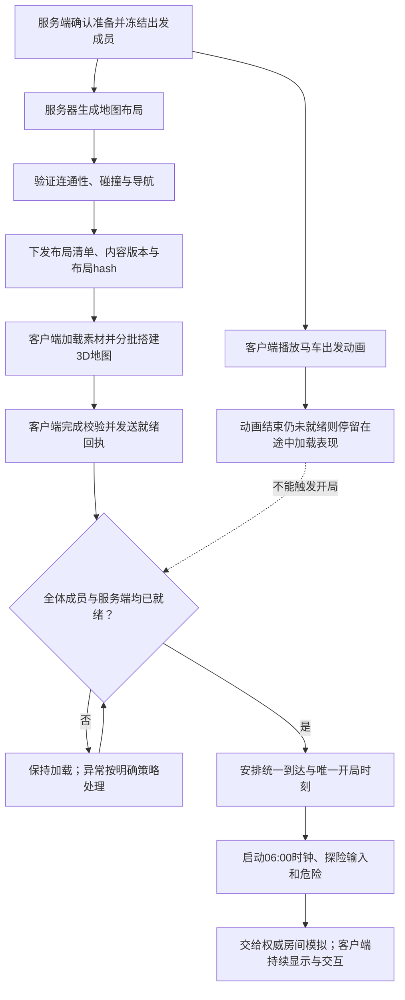

# ExpeditionStartup：探险启动编排

## 用途与边界

本模块拥有“玩家准备出发→马车动画→服务器生成地图→客户端搭建→全员到达→统一开局”的完整流程，归属Game.Server的房间生命周期。

它负责判断各阶段是否完成、协调参与模块和推进房间状态。地图随机算法由地图生成模块负责；3D实例化由客户端地图搭建模块负责；本模块不直接操作预制件、渲染、网络Socket或资产数据库。

来源：需求规格第4、7、8节，技术架构第4.1、5、9节，以及用户认可的服务端生成布局、客户端搭建流程。下文区分已确认玩法与本次明确的工程契约；加载超时、断线处置、财宝规则仍待定。

## 必须遵守的规范

| 规范ID | 规则 | 状态 |
|---|---|---|
| START-001 | 支持1～4人；以本次冻结的出发成员名单判断全员就绪，不能靠收到消息的数量判断 | 人数已确认；冻结名单为工程契约 |
| START-002 | 马车出发动画与服务器地图生成可以并行；动画和加载不消耗探险时间 | 已确认 |
| START-003 | 服务器生成并验证唯一权威布局；客户端按同一布局和内容版本搭建，不能自行重新随机或偷偷换图 | 已确认方向及一致性契约 |
| START-004 | 布局有真正的高度变化，由预制房间、走廊、楼梯、坡道组成；地下城永久不可破坏 | 已确认 |
| START-005 | 服务端地图、碰撞及导航验证通过，且全体出发成员完成关键资源加载、搭建与一致性校验，才可安排统一到达 | 已确认全员加载；关键依赖为工程契约 |
| START-006 | 统一到达后按唯一服务端开局时刻启动06:00时钟、探险输入和危险；不额外提供落地安全期 | 已确认 |
| START-007 | 重复准备消息、就绪回执、开局调度不得重复推进或重置时钟；旧局、旧地图版本及非成员消息不能满足屏障 | 工程契约 |
| START-008 | 开局后服务端持续负责权威状态；本模块将控制权交给房间模拟模块，不能把地图发完就关闭服务器 | 架构契约 |
| START-009 | 布局不通过或关键依赖未完成时不能开局；具体重试预算、超时时长和退出处置待定，不能擅自缩减成员继续 | 安全前置条件已明确；处置策略待定 |
| START-010 | 下发地图结构不等于公开全部怪物、财宝和私人事件；布局hash验证一致性，不证明客户端可信 | 架构契约 |

## 完整流程

“统一”指同一服务端逻辑开局时刻，不承诺不同设备在同一物理瞬间完成屏幕显示。提前调度、时钟映射、迟到消息和断线恢复由后续协议测试约束；不能让客户端以收到消息的时间自行重置探险时钟。

## 协作模块与职责

以下是职责划分，除已有WorldClock外，其余协作者尚未建立实现：

| 模块 | 负责 | 不负责 |
|---|---|---|
| Server/ExpeditionStartup（本模块） | 生命周期、阶段屏障、就绪成员集合、唯一开局调度 | 直接生成几何、渲染画面、执行战斗 |
| Server/DungeonGeneration | 选择预制模块，生成包含高度与连接关系的布局 | 网络广播、马车动画 |
| Server/MapValidation | 检查布局可达性、碰撞和导航准备状态 | 判断玩家是否加载完成 |
| Client/DungeonAssembly | 获取对应内容，按清单搭建场景并报告结果 | 自行决定地图、改变全局时间 |
| Client/DeparturePresentation | 马车出发、途中加载、到达表现 | 根据动画是否结束决定开局 |
| Contracts / Platform | 消息格式与版本、身份验证、传输及重试 | 决定玩法状态转换 |
| [Domain/WorldClock](../../Domain/WorldClock/README.md) | 已实现的纯时钟规则，接收一次合法Start | 判断队伍或地图是否就绪 |
| Server/RoomSimulation | 开局后怪物、战斗、物品和时间的权威运行 | 用客户端结果替代权威判断 |

## 接口与依赖

接口尚未编码。以下是设计约束，消息名沿用架构文档：

- 输入出发上下文：`departureId`、`runId`、`rosterRevision`、冻结成员ID和已校验的构建/协议/内容版本。装备或资产锁定由上游提供结果，本模块不实现扣账。
- 地图准备结果：本局`mapRevision`、`contentVersion`、`layoutHash`与服务器验证结论。布局清单包含模块实例ID、预制件ID、位置、旋转、连接关系和到达点；完整字段由地图契约定义。
- 输出`MapAvailable`：小清单本体或清单地址及版本/hash。已有模型与贴图复用预构建资源，缺失内容通过资源加载层获取；不要求服务器每局现场构建AssetBundle。
- 输入`ClientReady`：经身份验证的成员ID，以及匹配本局的`runId`、`rosterRevision`、`mapRevision`和`layoutHash`。服务端按成员集合去重；关键碰撞与必要声音未准备好不能报告ready。
- 输出开局调度：本局唯一`GameStartTick`或等价的服务端时间标识。tick频率与传输协议由对应模块确定，不在本模块写死。服务端在该逻辑时刻调用WorldClock.Start并启动危险模拟。
- 输出状态：`Departing → Loading → Arriving → Exploring`。此为房间生命周期的启动子流程；失败/中止分支不得直接套用死亡惩罚或结算规则。

本模块只依赖公开接口与Domain规则。时间源、地图生成器、消息发送器和客户端回执均可注入测试替身。客户端按布局搭建不要求各端独立运行随机算法，也不要求各端物理模拟逐帧完全一致。

错误边界：未匹配身份或版本的回执不能改变就绪集合；重复匹配回执无额外副作用；失效局的延迟结果不能重新激活本局。具体错误码、超时计时起点和断线处置必须在实现前补齐契约。

## 测试与执行

当前仅建立先行测试矩阵，尚未创建可执行测试、接口桩或实现。下列用例名是计划标识，不是已存在文件；不能计入现有55个通过检查。

| 规范ID | 先行用例 | 预期 |
|---|---|---|
| START-001/005 | AllFrozenMembersRequired | 1人和4人边界均正确；3名成员ready不能满足4人局 |
| START-002 | LoadingDoesNotAdvanceExpeditionClock | 任意推进虚拟加载时间，探险时钟仍未开始 |
| START-003/005 | MapAndContentMustMatch | 地图未验证、版本/hash不一致时不能开局 |
| START-005 | ServerReadinessIsRequired | 客户端全ready但服务端导航未完成，继续等待 |
| START-005/006 | AnimationEndCannotStartExpedition | 动画结束或某个客户端先加载完成，均不能自行启动危险 |
| START-006/007 | StartOnceAtAuthoritativeArrival | 满足所有条件后只调度一次开局；到达时06:00且无额外安全期 |
| START-007 | DuplicateForeignAndStaleReceipts | 重复回执不能凑人数；非成员、旧局和旧版本回执不能推进状态 |
| START-008 | SimulationContinuesAfterStartup | 完成启动后仍向房间模拟交接；怪物、时间和物品保持服务端权威 |
| START-009 | GenerationFailureCannotStart | 生成失败或关键资源缺失不进入Exploring；未定处置另列待决用例 |
| START-010 | ManifestExcludesPrivateGameState | 清单契约不夹带未授权公开的怪物调度、实际财宝定义或私人事件 |

START-004由地图生成/资源模块的三维布局及不可破坏约束测试覆盖；本模块接收其验证结果，不重复实现几何检查。最小集成验收应使用真实服务端和两个真实客户端，验证相同布局、多层可达、导航跨层和全员统一开局。微信真机另测加载耗时、峰值内存、分帧搭建与网络适配。

实现前先建立Server测试项目并记录真实执行命令；目前没有可报告的Red/Green或联机验收结果。等待超时、成员掉线、备用地图/重试次数的测试预期需先明确，不从建议反推既定玩法。

## AI修改约束

- 先更新本README和受影响协议规范，再编写可执行测试；看到有效Red后再实现。
- 本模块只承担启动编排；地图几何委托给Domain/DungeonLayout，不混入网络、怪物或财宝实现。
- 不能将所有协作者的代码塞进本模块；不能绕过到达屏障直接调用WorldClock.Start。
- 财宝占格、内容、分配等等待用户设计；加载超时、断线恢复、生成失败处置仍待定。

## 验证与已知限制

已完成流程归属和规范整理；尚未建立Server程序集、对应自动测试或服务器实例。团结支持服务端构建、运行时预制件实例化与资源加载，是方案的基础能力；并不等于本项目已验证联机、导航或微信性能。

参考：[服务端构建](https://docs.unity.cn/cn/tuanjiemanual/Manual/dedicated-server-build.html)、[运行时实例化预制件](https://docs.unity.cn/cn/tuanjiemanual/Manual/InstantiatingPrefabs.html)、[AssetBundle](https://docs.unity.cn/cn/tuanjiemanual/Manual/AssetBundlesIntro.html)、[NavMesh连接](https://docs.unity3d.com/Packages/com.unity.ai.navigation@1.1/manual/NavMeshLink.html)。

地图核心现已实现于[DungeonLayout](../../Domain/DungeonLayout/README.md)。Generate返回成功布局后仍需编排层执行资源与服务端就绪流程；几何成功不能直接启动时钟。
